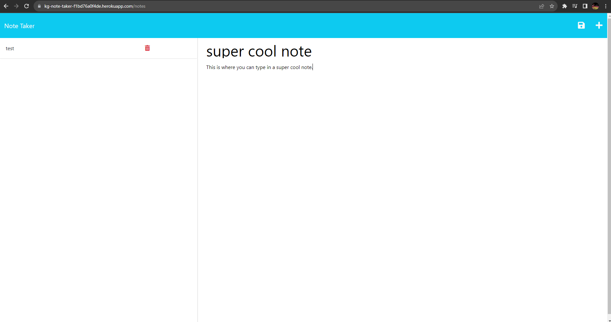

# KyleGranNoteTaker

## Table of Contents
- Description
- Features
- Credits

## Description

This application is a Node.js based web app that is designed  to create, manage, and store notes.

## Features

- This note taker allows you create, view, edit, and delete notes.
- There is a simple intuitive user interface.
- This app has a mobile-responsive design for access on any device.

## Credits

GitHub Repo: https://github.com/Kgran12/KyleGran-WorkDayScheduler

Heroku Deployed site: https://kg-note-taker-f1bd76a0f4de.herokuapp.com/notes

screenshot -